# PPTX Shredder 🎯

**One tool. One purpose. Rock solid.**

Transform PowerPoint presentations into LLM-optimized markdown. Built for technical trainers who need dead-simple reliability.

> **Does one thing and does it very, very well** ✨

## ⚡ Quick Start

### Step 1: Get Running (30 seconds)
```bash
# Clone and setup
git clone https://github.com/timothywarner-org/pptx-shredder.git
cd pptx-shredder
pip install -r requirements.txt

# Drop your PPTX files in input/ folder, then:
python shred.py

# ✅ Done! Your markdown is in output/
```

### Step 2: Use from Claude Desktop (optional)
```bash
# Global access (works from any directory)
claude mcp add pptx-shredder npx -y @timothywarner/pptx-shredder-mcp

# Now use in Claude Desktop from any project:
# "Use shred_pptx to process my presentation.pptx"
```

## 🧠 How It Works


## 📁 Project Structure

```
pptx-shredder/                 🏠 Main project directory
├── 🚀 shred.py               ← Entry point (run this!)
├── 📋 requirements.txt       ← Python dependencies  
├── 📦 package.json           ← npm package for global MCP access
├── ⚙️ config.yaml           ← Settings (optional)
├── 🔌 mcp_server.py         ← MCP server (Python)
├── 📄 .mcp.json             ← MCP configuration (local + global)
│
├── 📂 bin/                   🌍 Global npm package entry
│   └── mcp-server.js        ← Node.js wrapper for global access
│
├── 📂 src/                   🧠 Core application logic
│   ├── 🔍 extractor.py      ← PPTX → content extraction
│   ├── ✨ formatter.py      ← Content → markdown + chunking
│   ├── 🎛️ shred.py          ← CLI interface with Rich UI
│   └── 🛠️ utils.py          ← Helpers & token counting
│
├── 📂 input/                 📥 Drop your PPTX files here
│   └── 📖 README.md         ← Usage instructions
│
├── 📂 output/                📤 Generated markdown appears here
│   └── 📖 README.md         ← What gets created
│
├── 🧪 tests/                 🔬 64 comprehensive tests
│   ├── test_extractor.py    ← Content extraction tests
│   ├── test_formatter.py    ← Markdown generation tests
│   └── test_integration.py  ← End-to-end workflow tests
│
├── 🐳 .devcontainer/        📦 VS Code dev environment
├── 🤖 .github/              ⚙️ CI/CD & automation
│   ├── workflows/           ← GitHub Actions
│   └── dependabot.yml      ← Dependency updates
│
└── 📚 docs/                  📖 Documentation
    └── PRD.md               ← Product requirements
```

## 🎯 What It Does (The Magic)

**Single Purpose**: Convert PPTX → LLM-ready markdown  
**Rock Solid**: 64 tests, 95%+ coverage, enterprise CI/CD  
**Dead Simple**: Drop files, run command, collect results  

### Core Intelligence
- **🧠 Pattern Recognition**: Detects modules, labs, exercises, learning objectives
- **📚 Context Preservation**: Maintains instructional flow and narrative
- **🤖 LLM Optimization**: Token-counted chunks (1500-2000) with smart overlap
- **💻 Code Detection**: Identifies and formats code in 15+ languages
- **📋 Rich Metadata**: YAML frontmatter with semantic context

### Enterprise Training Intelligence
- **🎓 Pedagogical Awareness**: Categorizes instructor notes by intent (timing, emphasis, tips, warnings)
- **📊 Difficulty Assessment**: Automatic difficulty level detection (beginner/intermediate/advanced) 
- **⏱️ Time Estimation**: Activity-based duration calculation with multipliers
- **🔍 Prerequisites Detection**: Extracts required knowledge from content and notes
- **📈 Learning Analytics**: Cognitive load, interaction level, and learning mode analysis
- **🛡️ Compliance Ready**: Detects regulatory markers (GDPR, HIPAA, SOX, ISO, NIST, PCI)
- **🎯 Assessment Extraction**: Identifies quiz questions and knowledge checks
- **🖼️ Visual Context**: Describes images, tables, charts, and layout semantics

## 📖 Usage Guide

### Basic Commands
```bash
# Production mode - scan input/ folder
python shred.py

# Process specific files  
python shred.py presentation.pptx course.pptx

# Preview mode (no files created)
python shred.py --dry-run

# Show help
python shred.py --help
```

### Advanced Options
```bash
# Custom chunking strategy
python shred.py --strategy sequential --chunk-size 2000

# Verbose output with detailed logging
python shred.py --verbose

# Custom output directory
python shred.py --output-dir ./my-markdown

# Force overwrite existing files
python shred.py --force
```

### Processing Strategies
- **`instructional`** (default): Smart chunking that preserves learning modules
- **`sequential`**: Simple slide-by-slide processing
- **`single`**: One file per presentation

## 🎯 What It Does

### Core Features
PPTX Shredder intelligently:
- **Extracts Everything**: Text, speaker notes, slide structure, code blocks
- **Recognizes Patterns**: Modules, labs, exercises, learning objectives
- **Optimizes for LLMs**: Token-counted chunks (1500-2000 tokens) with overlap
- **Preserves Context**: Instructional narrative and relationships
- **Rich Metadata**: YAML frontmatter with learning context
- **Code Detection**: Identifies and formats code in 15+ languages
- **Beautiful UI**: Progress bars, tables, and colored output

### Instructional Design Awareness
- Detects module boundaries and learning objectives
- Preserves lab instructions and exercise context  
- Maintains teaching flow and narrative structure
- Groups related content intelligently

## 📄 Output Example

```markdown
---
module_id: 01-azure-storage-fundamentals
module_title: Azure Storage Fundamentals
slide_range: [1, 8]
chunk_index: 1
total_chunks: 3
learning_objectives:
  - Configure blob storage with appropriate security settings
  - Implement lifecycle management policies for cost optimization
  - Apply compliance requirements for enterprise data governance
prerequisites:
  - Basic understanding of cloud computing concepts
  - Familiarity with Azure portal navigation
concepts: ["Azure", "Storage", "Security", "Compliance", "GDPR"]
difficulty_level: intermediate
estimated_duration: 25 minutes
learning_context:
  primary_learning_mode: experiential
  cognitive_load: medium
  interaction_level: high
activity_type: hands-on-lab
compliance_markers: ["GDPR", "SECURITY"]
instructor_guidance_categories: ["timing", "emphasis", "examples", "tips", "warnings"]
---

# Azure Storage Fundamentals

*This is part 1 of 3 in the Azure Storage Fundamentals module series.*

**🔒 Compliance Notice:** This content relates to GDPR, SECURITY requirements.

## 📋 Prerequisites
Before starting this module, you should have:
- Basic understanding of cloud computing concepts
- Familiarity with Azure portal navigation

## 🎯 Learning Objectives
By the end of this module, you will be able to:
- Configure blob storage with appropriate security settings
- Implement lifecycle management policies for cost optimization
- Apply compliance requirements for enterprise data governance

## 📚 Content

### 🧪 Storage Account Configuration
**Objective**: Create and configure a storage account with enterprise security

#### 💻 Lab Code:
```powershell
# Create storage account with security features
$storageAccount = New-AzStorageAccount `
  -ResourceGroupName "rg-storage-lab" `
  -Name "stentsec$((Get-Random))" `
  -AllowBlobPublicAccess $false `
  -EnableHttpsTrafficOnly $true `
  -MinimumTlsVersion "TLS1_2"
```

#### 🧠 Knowledge Check:
**Q**: What is the minimum TLS version required for enterprise security compliance?

#### 👨‍🏫 Instructor Guidance:
**⏱️ Timing:** Allow 8 minutes for storage account creation
**⚠️ Emphasis:** Critical to stress importance of disabling public blob access
**💡 Examples:** Show real-world scenario where public access led to data breach
**🔧 Tips:** Use naming conventions that include environment and purpose
```

## 🔧 Status: Production Ready

| Aspect | Status | Details |
|--------|--------|---------|
| **🎯 Core Function** | ✅ Complete | PPTX → Markdown conversion working perfectly |
| **🧪 Testing** | ✅ 64 tests, 95%+ coverage | Unit, integration, cross-platform tests |
| **🚀 CI/CD** | ✅ Enterprise grade | GitHub Actions, Dependabot, auto-review |
| **📊 UI** | ✅ Rich console | Progress bars, tables, colored output |
| **🔒 Security** | ✅ Local only | Zero network calls, NDA-friendly |
| **🌍 Global Access** | ✅ npm package | Works from any directory via npx |
| **📝 Content Quality** | ✅ Automated linting | Markdown formatting and URL validation |
| **⚡ Platform** | ✅ Cross-platform | Windows, macOS, Linux support |
| **🐳 DevOps** | ✅ Full automation | Dev containers, automated dependencies |

## 🎯 Rock Solid Philosophy

**Single Responsibility**: We do ONE thing - convert PPTX to LLM-ready markdown  
**Zero Surprises**: Predictable, reliable behavior every time  
**Maximum Clarity**: Simple workflow, clear output, obvious structure  
**Bullet Proof**: Comprehensive testing prevents regressions  
**Privacy First**: All processing local, no external dependencies

## 🎬 Try It Now

### Quick Demo
```bash
# Run the interactive demo
python demo.py

# Or try with sample presentations
cp samples/*.pptx input/
python shred.py
```

### Real-World Example
```bash
# Process a technical training deck
python shred.py "Azure Fundamentals Course.pptx"

# Output includes:
# - Module detection and grouping
# - Lab instructions preserved
# - Code blocks properly formatted
# - Learning objectives extracted
# - Smart chunking for LLM context windows
```

## 🧪 Development

### Testing
```bash
# Run all tests with verbose output
PYTHONPATH=src python -m pytest tests/ -v

# Run with coverage report
PYTHONPATH=src python -m pytest tests/ --cov=src --cov-report=html

# Run specific test category
PYTHONPATH=src python -m pytest tests/test_extractor.py -v

# Quick test run
make test
```

### Code Quality
```bash
# Format code
black src/ tests/

# Type checking
mypy src/

# Lint code
ruff check src/

# Run all checks
make check
```

### Development Workflow
```bash
# Install dev dependencies
pip install -r requirements-dev.txt

# Run in watch mode
make watch

# Build and test
make all
```

### Content Quality
```bash
# Check markdown formatting and URLs
./scripts/local-content-check.sh

# Markdown linting only
./scripts/local-content-check.sh markdown-only

# URL validation only
./scripts/local-content-check.sh urls-only
```

## 👥 Perfect For

### Technical Trainers
- Convert course materials for AI-assisted delivery
- Create searchable knowledge bases from presentations
- Generate practice questions and assessments

### Instructional Designers  
- Repurpose existing content for new formats
- Extract learning objectives and outcomes
- Analyze course structure and flow

### Content Teams
- Build AI training datasets from presentations
- Create documentation from training materials
- Generate summaries and abstracts

### Developers
- Process technical presentations for RAG systems
- Extract code examples and documentation
- Build knowledge bases for AI assistants

## 🏗️ Simple Architecture

```mermaid
graph TB
    subgraph "🎯 Single Purpose Design"
        A[📁 Input PPTX Files] --> B[🔍 Extractor]
        B --> C[✨ Formatter] 
        C --> D[📄 Output Markdown]
    end
    
    subgraph "🧠 Core Components"
        B --> B1[Extract Text]
        B --> B2[Extract Notes]
        B --> B3[Detect Patterns]
        
        C --> C1[Smart Chunking]
        C --> C2[Add Metadata]
        C --> C3[Generate Files]
    end
    
    subgraph "🔌 Integrations"
        E[🖥️ Claude Desktop] --> F[MCP Server]
        F --> B
        
        G[🎛️ CLI Interface] --> B
    end
    
    style A fill:#e1f5fe
    style D fill:#e8f5e8
    style B fill:#fff3e0
    style C fill:#f3e5f5
```



## 🔧 Configuration

Default settings in `config.yaml`:
```yaml
extraction:
  extract_text: true
  extract_notes: true
  extract_images: false  # Coming soon
  
formatting:
  default_chunk_size: 1500
  chunk_overlap: 200
  include_metadata: true
  
output:
  overwrite_existing: false
  create_summary: true
```

## 🚀 Roadmap

- [x] Core PPTX text extraction
- [x] Instructional design patterns
- [x] LLM-optimized chunking
- [x] Rich console interface
- [x] Comprehensive testing
- [x] CI/CD pipeline
- [ ] Image extraction and description
- [ ] Table preservation
- [ ] Multi-language support
- [ ] Web interface
- [ ] API endpoint

## 📚 Documentation

- [CLAUDE.md](CLAUDE.md) - AI assistant context
- [docs/PRD.md](docs/PRD.md) - Product requirements
- [GitHub Wiki](https://github.com/timothywarner-org/pptx-shredder/wiki) - Extended docs

## 🤝 Contributing

Contributions welcome! This project uses:
- Automated PR review assignment
- GitHub Copilot code review
- Comprehensive test requirements
- Pre-commit hooks for quality

See [CONTRIBUTING.md](CONTRIBUTING.md) for guidelines.

## 📄 License

MIT License - see [LICENSE](LICENSE)

---

## 🎯 The Bottom Line

**PPTX Shredder does ONE thing and does it very, very well.**

✅ **Zero Configuration** - Works out of the box  
✅ **Zero Surprises** - Predictable, reliable results  
✅ **Zero Network** - Completely local processing  
✅ **Maximum Clarity** - Simple workflow, clear output  

**Built by technical trainers, for technical trainers.** 🎓

📧 Questions? 🐛 Found a bug? [Open an issue](https://github.com/timothywarner-org/pptx-shredder/issues)